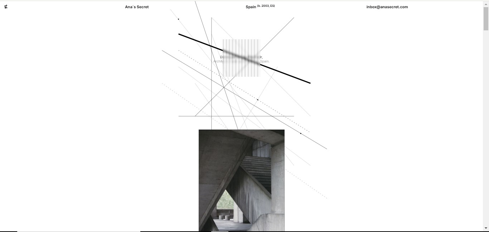
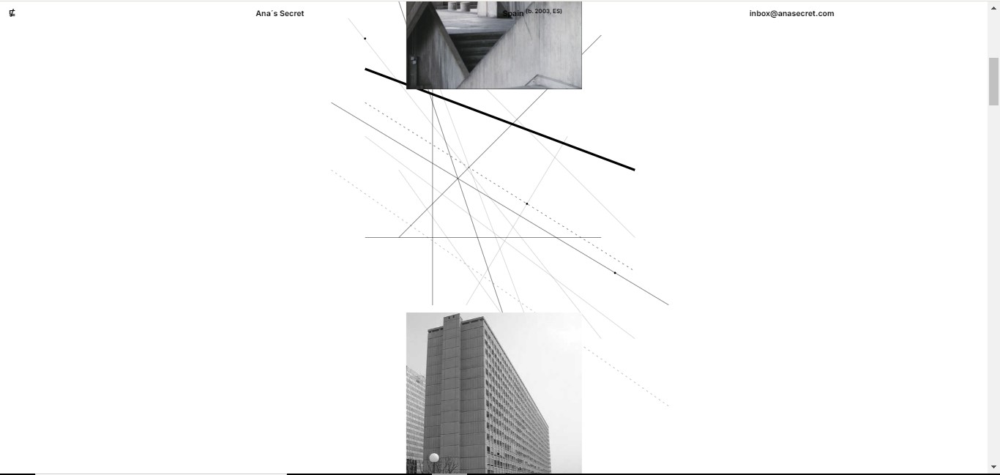

Ana's Secret - Image Display

Ana's Secret is an image display built with Next.js, featuring a minimalist and avant-garde design. The site showcases a vertical scrolling gallery of images, overlaid with a stylized SVG inspired by brutalist architecture.

Live Demo
https://an4s3crwt.github.io/architect-folio/

Features
Vertical Image Gallery: Scroll through a curated series of full-screen images.
Interactive SVG: A fixed SVG design adds visual complexity with brutalist-inspired lines and circles.
Responsive Design: Ensures a smooth experience across devices, from mobile to desktop.

Technologies Used
Next.js: Framework for building web applications and static sites.
Tailwind CSS: For fast and efficient interface styling.
SVG: Used to create complex background visuals.

Installation
To run this project locally:

Clone the repository:
git clone https://github.com/your_username/your_repository.git

Navigate to the project directory:
cd your_repository

Install dependencies:
npm install
Start the development server:

npm run dev
The project will be live at http://localhost:3000.

License
This project is licensed under the MIT License.